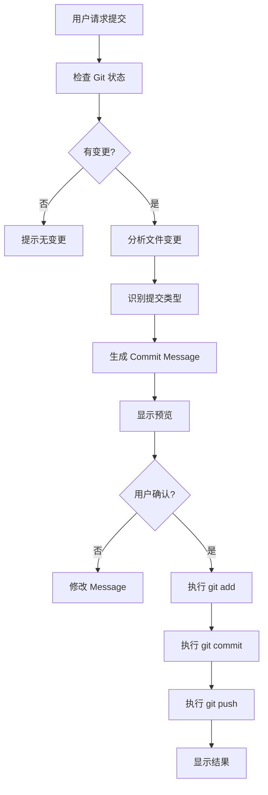

# Git 自动提交工具

根据当前开发内容自动生成语义化 commit message 并提交到 Git 仓库。

## 快速开始

当用户请求提交代码时：

1. **检查 Git 状态** - 查看当前修改的文件
2. **分析变更内容** - 识别修改类型和范围
3. **生成 Commit Message** - 使用语义化提交规范
4. **执行提交** - git add、commit、push
5. **确认结果** - 显示提交信息和远程链接

## 核心功能

### 1. 自动识别提交类型

根据修改的文件自动判断提交类型：

| 提交类型 | 触发条件 | 示例 |
|---------|---------|------|
| `feat:` | 新增功能、组件、API | 添加用户登录功能 |
| `fix:` | 修复 bug、错误 | 修复图片上传失败问题 |
| `docs:` | 文档更新（.md 文件） | 更新 API 文档 |
| `style:` | 样式调整（.css/.less） | 优化按钮样式 |
| `refactor:` | 代码重构 | 重构用户服务层 |
| `perf:` | 性能优化 | 优化数据库查询 |
| `test:` | 测试相关 | 添加单元测试 |
| `chore:` | 构建/配置/依赖 | 更新依赖包 |
| `ci:` | CI/CD 配置 | 更新 GitHub Actions |

### 2. 智能 Commit Message 生成

**格式规范：**
```
<type>(<scope>): <subject>

<body>

<footer>
```

**示例：**
```
feat(auth): 添加用户登录功能

- 实现 JWT 认证
- 添加登录 API 接口
- 创建登录页面组件

Closes #123
```

### 3. 文件变更分析

**前端文件识别：**
- `frontend/src/app/` → 页面路由
- `frontend/src/components/` → React 组件
- `frontend/src/lib/api/` → API 调用
- `frontend/src/styles/` → 样式文件
- `package.json` → 依赖更新

**后端文件识别：**
- `backend/app/api/` → API 路由
- `backend/app/models/` → 数据库模型
- `backend/app/schemas/` → 数据模型
- `backend/app/services/` → 业务逻辑
- `requirements.txt` → 依赖更新

**配置文件识别：**
- `docker/` → Docker 配置
- `.env.example` → 环境变量
- `*.md` → 文档更新

### 4. 提交流程

```bash
# 1. 检查 Git 状态
git status

# 2. 添加文件
git add .

# 3. 提交更改
git commit -m "feat: 添加用户登录功能"

# 4. 推送到远程
git push origin main
```

## 使用示例

### 示例 1: 新增功能

**用户输入：**
```
提交代码
```

**AI 分析：**
- 检测到新增文件：`frontend/src/app/login/page.tsx`
- 检测到新增文件：`backend/app/api/v1/endpoints/auth.py`
- 判断类型：`feat`
- 范围：`auth`

**生成的 Commit：**
```
feat(auth): 添加用户登录功能

- 创建登录页面组件
- 实现登录 API 接口
- 添加 JWT 认证逻辑
```

### 示例 2: 修复 Bug

**用户输入：**
```
修复了图片上传的问题，提交一下
```

**AI 分析：**
- 检测到修改：`backend/app/services/media_service.py`
- 用户明确说明：修复问题
- 判断类型：`fix`
- 范围：`media`

**生成的 Commit：**
```
fix(media): 修复图片上传失败问题

- 修正文件大小验证逻辑
- 添加错误处理
```

### 示例 3: 文档更新

**用户输入：**
```
更新了文档，提交
```

**AI 分析：**
- 检测到修改：`README.md`, `LOCAL_DEVELOPMENT.md`
- 判断类型：`docs`

**生成的 Commit：**
```
docs: 更新项目文档

- 完善本地开发指南
- 更新 README 快速开始部分
```

### 示例 4: 配置更新

**用户输入：**
```
修改了 Docker 配置，提交代码
```

**AI 分析：**
- 检测到修改：`docker/docker-compose.dev.yml`
- 判断类型：`chore`
- 范围：`docker`

**生成的 Commit：**
```
chore(docker): 更新 Docker 开发环境配置

- 调整数据库端口映射
- 优化容器健康检查
```

## 工作流程

### 标准流程



### 首次提交流程

如果项目还没有初始化 Git：

```bash
# 1. 初始化仓库
git init

# 2. 设置主分支
git branch -M main

# 3. 添加远程仓库
git remote add origin https://github.com/ws0424/life-record-platform.git

# 4. 首次提交
git add .
git commit -m "chore: 初始化项目"
git push -u origin main
```

## 提交规范

### Commit Message 格式

**基本格式：**
```
<type>(<scope>): <subject>
```

**完整格式：**
```
<type>(<scope>): <subject>

<body>

<footer>
```

### Type 类型

- `feat`: 新功能
- `fix`: 修复 bug
- `docs`: 文档更新
- `style`: 代码格式（不影响功能）
- `refactor`: 重构
- `perf`: 性能优化
- `test`: 测试
- `chore`: 构建/工具
- `ci`: CI/CD
- `revert`: 回滚

### Scope 范围

**前端：**
- `ui`: UI 组件
- `page`: 页面
- `api`: API 调用
- `store`: 状态管理
- `style`: 样式

**后端：**
- `auth`: 认证
- `user`: 用户
- `post`: 内容
- `comment`: 评论
- `media`: 媒体
- `db`: 数据库

**通用：**
- `config`: 配置
- `deps`: 依赖
- `docker`: Docker
- `docs`: 文档

### Subject 主题

- 使用中文描述
- 简洁明了（50字以内）
- 使用动词开头
- 不要句号结尾

**好的示例：**
- ✅ `添加用户登录功能`
- ✅ `修复图片上传失败问题`
- ✅ `优化数据库查询性能`

**不好的示例：**
- ❌ `更新` （太模糊）
- ❌ `修改了一些代码` （不具体）
- ❌ `fix bug` （应该用中文）

## 高级功能

### 1. 批量提交

如果有多个独立的功能修改：

```bash
# 分别提交不同的功能
git add frontend/src/app/login/
git commit -m "feat(auth): 添加登录页面"

git add backend/app/api/v1/endpoints/auth.py
git commit -m "feat(auth): 添加登录 API"

git push origin main
```

### 2. 交互式提交

询问用户确认：

```
检测到以下变更：
  M frontend/src/app/login/page.tsx
  M backend/app/api/v1/endpoints/auth.py
  M README.md

建议的提交信息：
  feat(auth): 添加用户登录功能

是否确认提交？(y/n)
```

### 3. 自动生成 Body

对于重要的提交，自动生成详细的 body：

```
feat(auth): 添加用户登录功能

变更内容：
- 创建登录页面组件 (frontend/src/app/login/page.tsx)
- 实现登录 API 接口 (backend/app/api/v1/endpoints/auth.py)
- 添加 JWT 认证逻辑
- 更新 API 文档

技术细节：
- 使用 Ant Design Form 组件
- 实现 JWT Token 认证
- 添加密码加密存储
```

### 4. 关联 Issue

如果提交关联 GitHub Issue：

```
fix(media): 修复图片上传失败问题

- 修正文件大小验证逻辑
- 添加错误处理
- 优化上传进度显示

Closes #123
```

## 错误处理

### 1. 没有变更

```
❌ 错误: 没有需要提交的变更
提示: 请先修改文件后再提交
```

### 2. 未初始化 Git

```
⚠️  警告: 未检测到 Git 仓库
正在初始化...
✓ Git 仓库初始化完成
```

### 3. 推送失败

```
❌ 错误: 推送失败
原因: 远程仓库有新的提交
建议: 先执行 git pull 合并远程更改
```

### 4. 冲突处理

```
❌ 错误: 检测到合并冲突
冲突文件:
  - frontend/src/app/login/page.tsx
  - backend/app/api/v1/endpoints/auth.py

请手动解决冲突后再提交
```

## 最佳实践

### 1. 提交频率

- ✅ 完成一个小功能就提交
- ✅ 修复一个 bug 就提交
- ✅ 每天至少提交一次
- ❌ 不要积累太多修改再提交

### 2. 提交粒度

- ✅ 每次提交只做一件事
- ✅ 相关的修改放在一起
- ❌ 不要把多个功能混在一起提交

### 3. 提交信息

- ✅ 清晰描述做了什么
- ✅ 说明为什么这样做
- ✅ 提供必要的上下文
- ❌ 不要写无意义的信息

### 4. 代码审查

提交前检查：
- ✅ 代码格式正确
- ✅ 没有调试代码
- ✅ 没有敏感信息
- ✅ 测试通过

## 配置

### Git 配置

```bash
# 设置用户信息
git config --global user.name "Your Name"
git config --global user.email "your.email@example.com"

# 设置默认编辑器
git config --global core.editor "code --wait"

# 设置默认分支名
git config --global init.defaultBranch main
```

### 项目配置

在 `.cursorrules` 中配置：

```yaml
git:
  repository: https://github.com/ws0424/life-record-platform.git
  branch: main
  commit_style: conventional
  auto_push: true
```

## 使用脚本

项目根目录提供了 `git-commit.sh` 脚本：

```bash
# 使用方法
./git-commit.sh "feat: 添加用户登录功能"

# 或者让 AI 自动生成
./git-commit.sh
```

## 注意事项

1. **敏感信息**
   - 不要提交 `.env` 文件
   - 不要提交密钥和密码
   - 使用 `.gitignore` 排除敏感文件

2. **大文件**
   - 不要提交大型二进制文件
   - 使用 Git LFS 管理大文件
   - 媒体文件使用对象存储

3. **分支管理**
   - 主分支：`main`
   - 开发分支：`develop`
   - 功能分支：`feature/xxx`
   - 修复分支：`fix/xxx`

4. **代码审查**
   - 重要功能使用 Pull Request
   - 团队协作时先 pull 再 push
   - 解决冲突后再提交

## 故障排除

### 问题 1: 推送被拒绝

```bash
# 解决方法
git pull origin main --rebase
git push origin main
```

### 问题 2: 提交信息写错

```bash
# 修改最后一次提交
git commit --amend -m "正确的提交信息"
git push origin main --force
```

### 问题 3: 提交了错误的文件

```bash
# 撤销最后一次提交（保留修改）
git reset --soft HEAD^

# 重新添加正确的文件
git add correct-files
git commit -m "正确的提交"
```

### 问题 4: 需要回滚

```bash
# 回滚到指定提交
git revert <commit-hash>
git push origin main
```

## 相关资源

- [Conventional Commits](https://www.conventionalcommits.org/)
- [Git 官方文档](https://git-scm.com/doc)
- [GitHub 使用指南](https://docs.github.com/)
- 项目仓库: https://github.com/ws0424/life-record-platform.git

